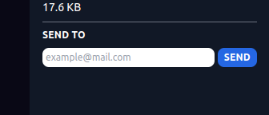

# Mailbook

[](https://packagist.org/packages/xammie/mailbook)
[](https://github.com/xammie/mailbook/actions?query=workflow%3Arun-tests+branch%3Amain)
[](https://github.com/xammie/mailbook/actions?query=workflow%3A"Fix+PHP+code+style+issues"+branch%3Amain)
[](https://packagist.org/packages/xammie/mailbook)

Mailbook is a Laravel package that lets you easily inspect your mails without having to actually trigger it in your
application.

[](https://mailbook.dev)

<p align="center"><a href="https://mailbook.dev/">View demo</a></p>

## Installation

You can install the package via composer:

```bash
composer require --dev xammie/mailbook
```

Next install mailbook into your application

```bash
php artisan mailbook:install
```

## Usage

The `mailbook:install` command will create a route file named `routes/mailbook.php`. In this file you can register your
emails.

```php
// This will use dependency injection if your mailable has parameters
Mailbook::add(VerificationMail::class);

// Use a closure to customize the parameters of the mail instance
Mailbook::add(function (): VerificationMail {
    $user = User::factory()->make();

    return new VerificationMail($user, '/example/url')
});
```

Next head over to `/mailbook` to preview the mailables.

## Registering mails

You can both register mailables that live in `App\Mails` and email notifications in `App\Notifications`.
```php
// Mailable
Mailbook::add(VerificationMail::class);

// Notification
Mailbook::add(InvoiceCreatedNotification::class);
```

You can also use dependency injection in the closure.

```php
// With dependency injection
Mailbook::add(function (VerificationService $verificationService): VerificationMail {
    return new VerificationMail($verificationService, '/example/url');
});

// Without dependency injection
Mailbook::add(function (): VerificationMail {
    $verificationService = app(VerificationService::class);
    
    return new VerificationMail($verificationService, '/example/url');
});
```

## Sending to a user

A notification will most of the time need a user (also called `notifiable` in the notification class).
You can set the desired user with the `::to()` method.

```php
Mailbook::to($user)->add(WelcomeNotification::class);
```

If you don't need a user you can also pass an e-mail address.

```php
Mailbook::to('example@mailbook.dev')->add(WelcomeNotification::class)
```

## Grouping multiple mails

To avoid having to pass the same `::to()` to every mailable that needs it you can use the `::group()` method. This will
automatically pass the notifiable to every mailable inside the group.

```php
Mailbook::to('example@mailbook.dev')->group(function () {
    Mailbook::add(WelcomeNotification::class);
    Mailbook::add(TrialEndedNotification::class);
});
```

## Variants

When creating mails you might have a couple of different scenario's that you want to test for one mail, you can use
variants to solve this.

```php
// Use a closure to customize the parameters of the mail instance
Mailbook::add(OrderCreatedMail::class)
    ->variant('1 item', fn () => new OrderCreatedMail(Order::factory()->withOneProduct()->create()))
    ->variant('2 items', fn () => new OrderCreatedMail(Order::factory()->withTwoProducts()->create()));
```

## Localization

When your application supports multiple languages you need to easily preview your mails in these languages. To enable
this feature you have to add the following code to the `mailbook.php` config file.

```php
'locales' => [
    'en' => 'English',
    'nl' => 'Dutch',
    'de' => 'German',
    'es' => 'Spanish'
],
```

This will display a dropdown in mailbook which you can use to switch to a different language.


## Using the database

Most of the time your mailables will need database models. Sometimes you will even preform queries when rendering these
mailables. Mailbook can automatically rollback database changes after rendering. You can enable it in the config with.

```php
'database_rollback' => true,
```

You can now safely use factories and other queries when registering your mailables.

```php
// All database changes are rolled back after rendering the mail.
Mailbook::add(function (): OrderShippedMail {
    $order = Order::factory()->create();
    $tracker = Tracker::factory()->create();
        
    return new OrderShippedMail($order, $tracker);
});
```

Database rollback is disabled by default.

## Sending Mails

Testing your mails outside the browser is important if you want to make sure that everything is displayed correctly.
You can use Mailbook to send mails to an email address of your choice using your default mail driver.



You can enable this by setting `send` to `true` in the config file.

```php
'send' => true,
```

## Customization

You can publish the config file with:

```bash
php artisan vendor:publish --tag="mailbook-config"
```

This is the contents of the published config file:

```php
return [
    'enabled' => env('APP_ENV') === 'local',
    'database_rollback' => false,
    'display_preview' => true,
    'locales' => [],
    'send' => false, 
    'route_prefix' => '/mailbook',
    'middlewares' => [Xammie\Mailbook\Http\Middlewares\RollbackDatabase::class],
    'show_credits' => true,
];
```

Optionally, you can publish the views using

```bash
php artisan vendor:publish --tag="mailbook-views"
```

## Testing

```bash
composer test
```

## Changelog

Please see [CHANGELOG](CHANGELOG.md) for more information on what has changed recently.

## Contributing

Please see [CONTRIBUTING](https://github.com/Xammie/.github/blob/main/CONTRIBUTING.md) for details.

## Security Vulnerabilities

Please review [our security policy](../../security/policy) on how to report security vulnerabilities.

## Credits

- [Max Hoogenbosch](https://github.com/Xammie)
- [All Contributors](../../contributors)

## License

The MIT License (MIT). Please see [License File](LICENSE.md) for more information.
